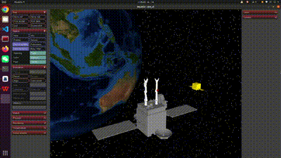

# 主要成果
学习深度强化学习，熟悉了解PPO算法。将PPO算法应用在简单环境CartPole-V0和之前的demo环境SpaceRobotState-Env中，可以实现规划控制的目的。

## 当前环境

目前可以实现机器人卫星的基本控制，包括机械臂的运动和基座的运动。
**动作action**：两条臂共14个关节速度，即代码中的`self.physics.data.ctrl`
**状态observation**：包含14个关节角度，14个关节速度，末端位置和角度，设定的目标位置和末端已到达的位置

**PS**:目前控制基座的方法是在xml文件中添加一个基座的`freejoint`，该关节即可实现基座的三维空间移动，并且会使self.physics.data多出六项数据：多出来的前六项表示基座的线速度和角速度。而控制机械臂的方法是在`actuator`属性中为每个关节添加驱动器，控制量为关节速度。这导致基座和机械臂控制的方式不同，控制基座只能直接该`physics.data.qvel`中前六项，而机械臂关节速度是通过`physics.data.ctrl`控制的。

### 当前测试环境
当前先测试固定基座的规划控制，因此先设置两个在机械臂运动范围内的目标点，即上图中的红色物体和蓝色物体。测试强化学习算法能否使机械臂移动到目标位置。由于暂且不考虑夹爪的控制，所以打算先测试不带夹爪的机械臂。

## 强化学习
目前使用PPO算法训练机器人卫星，采用的方式是PPO截断，使用的奖励函数如下：
$$ reward = -[0.001*d^2 + ln(d^2 + 1e-6)] $$
其中d是末端到目标点的距离，目前测试发现训练出来的策略是机械臂保持不动，输出奖励发现$ reward>0 $。这可能会导致机械臂采取保持不动的策略，奖励函数可能需要更改。

# 问题
再将PPO算法应用到双臂机器人卫星上时，算法总是不收敛，目前尝试过2000次迭代（训练了约18个小时），仍无法实现收敛，效果很差。目前尚未找到原因，仍需改进。

# 计划
（1）找到了SpaceRobotEnv的相关论文`A_Multi-Target_Trajectory_Planning_of_a_6-DoF_Free-Floating_Space_Robot_via_Reinforcement_Learning`，准备着手学习其中算法原理部分。
（2）将PPO算法应用到双臂机器人卫星上，初步实现规划控制。