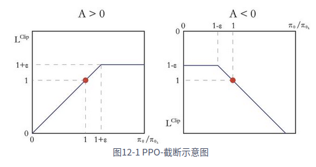
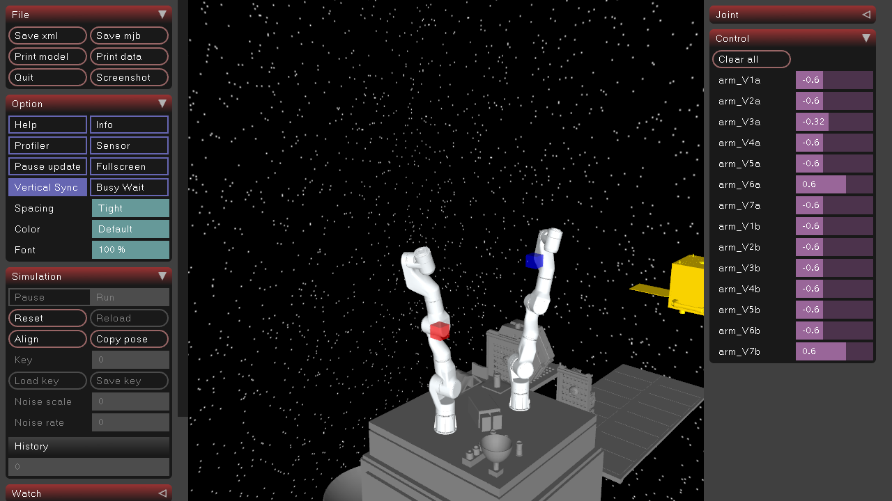

## 主要成果
通过学习Proximal Policy Optimization（PPO）算法，并在已有代码基础上进行改进，完成了双臂机械臂强化学习训练任务中的离散动作空间控制，提升了算法的适用性和训练效果。
### 主要学习内容
离散PPO和连续PPO的原理和算法实现，使用方式为PPO-clip。通过引入“截断概率比”的思想，限制了旧策略和新策略之间的变化幅度，从而实现更为稳定的策略更新。

### 问题
训练过程中发现训练后期的action(关节速度)全都超过的xml文件中设置的控制量上限，这导致训练成果失效，动作一直以最大值形式参与环境交互，导致训练效果不好。但是在更改xml文件中的控制量上限后，新的action仍会超过上限。

### 解决思路
找黄老师要了一份确定能够运行无误的PPO算法，在该算法基础上进行调整测试。