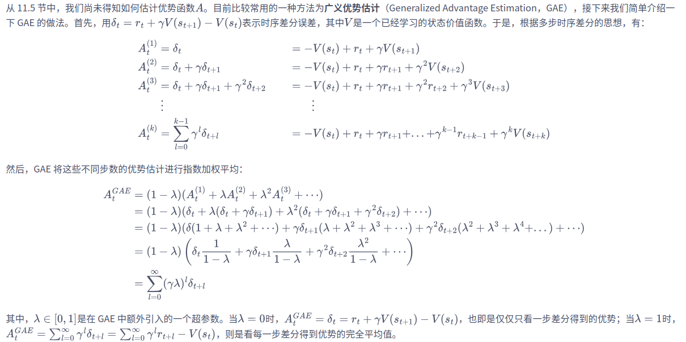

# 主要成果：
成功实现了基于PPO算法的固定基座双臂机器人的轨迹规划

## 代码分析
目前代码主要分为两部分：SatelliteEnv.py和ppo_dual_arm.py。前者构建了基于mujoco的机器人卫星环境，后者构建了ppo强化学习算法实现。

### SatelliteEnv
该部分首先构建了一个通用机器人环境`RobotEnv`，定义了基本函数，然后定义了一个继承`RobotEnv`的机器人卫星环境`SpaceRobotEnv`，定义了所有用到的函数。
#### RobotEnv
- `__init__()`:加载模型，给定渲染设置，初始化环境，状态量和规划目标，设置观测空间和动作空间，涉及函数为`_env_step()， _sample_goal(), _get_obs(), _set_action_space()`。
- `step()`:动作仿真，在`_set_action()`中执行动作，然后获取观测值，计算奖励。

#### SpaceRobotEnv
***`_get_obs()`***: 该函数定义了机器人卫星系统的观测量，观测量`obs=[cos_qpos, sin_qpos, qvel, achieved_goal]`。其中`cos_qpos, sin_qpos`是机械臂关节角度的正弦值和余弦值，这样定义的目的是为了保证运动过程中的连续性（如果关节旋转一周，那么关节角度会从-2pi突变到0，导致不连续）；`qvel`是机械臂关节角度，`achieved_goal`是已到达的目标位置，即机械臂末端位置。
***`_compute_cost()`***:该函数定义了机器人卫星执行动作后的奖励函数，函数接收参数包括`_get_obs()`中的观测值`state`，预先设定的目标位置`desired_goal`和ppo算法提供的动作`action`。设置了一个`state_size`的权重矩阵，对`state`中的位置信息提供大的权重，速度信息提供小的权重，其余权重为0，然后获取`action`的范数值。该函数实际上针对机器人卫星运动过程中的末端位置和目标位置距离（大权重），关节速度（小权重）和ppo算法提供动作进行了加权求和，制定了损失函数，返回损失函数的负值。
***PS***:以上两个函数是整个`SpaceRobotEnv`最重要的部分，定义了系统的观测量和奖励函数，对于ppo算法的收敛效果有很重要的意义。

`_env_setup()`:初始化时调用的函数，用于将预先设定好的初始关节角度设置好。
`_set_action()`:用于执行动作，将`action`送入到`self.physics.data.ctrl[:]`中，并通过`self.physics,step()`执行该动作。

### PPO算法
该部分构建了策略网络和价值网络，然后采用了基于PPO-裁剪的ppo算法。
#### PolicyNet
- `__init__()`:策略网络由三层线性隐藏层（linear1, linear2, linear3）和一个输出层（mu）组成。对每一层使用了正交初始化（orthogonal_init），并用los_std获取策略分布的标准差。
**正交初始化优点**：保证输入信号经过每一层时，不会因梯度爆炸或消失而导致学习困难。而且正交初始化的矩阵具有良好的数值特性，有助于避免训练初期梯度异常，以确保权重初始分布的正交性，通常有助于稳定训练。
- `forward()`:先依次通过隐藏层，使用 tanh 激活函数压缩输出值到[-1, 1]。输出层生成动作分布的均值mean，也通过tanh限制在[-1, 1]。定义正态分布，均值为mean，标准差与exp⁡(log_std)有关。最后从分布中采样动作，并限制其在[-1, 1]区间，并计算所采样动作的对数概率。
- `evaluate()`:功能与forward类似，但forward输入只包括state，而evaluate针对给定的state和action，计算该动作的对数概率，用于更新策略。同时使用PyTorch的分布方法entropy直接计算分布的熵，熵奖励项用于鼓励探索。
#### ValueNet
- `__init__()`:价值网络，使用ReLU激活函数。
- `forward()`:根据给定的状态state输出状态价值，用于计算优势函数。
#### ReplayMemory
回访缓存区，用于储存每次训练过程中的state，action，reward，next_state。在PPO算法中，由于是在线训练（on-policy）,所以每次都选用基于当前策略训练产生的数据。
#### PPOModel
该部分是PPO算法的agent部分，即具体的训练实现过程。
- `__init__()`:设置参数，策略网络和价值网络。动作是14个关节角度（两条七自由度机械臂），状态是`SpaceRobotEnv`中`_get_obs()`函数中定义的观测值`obs`，`obs`中包含关节角度的正弦余弦值，保证了角度变化的平滑性，防止角度突变造成的影响。
  - `gamma`:该参数即强化学习中的折扣因子，接近1则更适用于固定状态目标。
  - `lamda`:该参数是广义优势估计中引入的超参数，较大的$\lambda$通常适用于需要长期规划和估计的任务，较小的$\lambda$更适用于对短期回报敏感的任务。
- `get_action()`:根据当前状态从策略网络中获取动作和该动作的对数概率。
- `compute_return`:实现了 GAE (广义优势估计, Generalized Advantage Estimation) 中的 返回值计算，计算了每个时间步的返回值（returns）和优势函数（advantages），其计算过程如下：

- `train_model()`:首先从从经验回放池中获取一个批次的数据（这些数据是基于当前策略生成的），数据包括当前状态 (states_batch)、采取的动作 (actions_batch)、下一个状态(next_states_batch)、奖励 (rewards_batch)、以及是否终止的标记 (done_batch)。根据这些采样数据计算每个时间步的目标值和优势函数，再计算剪切目标，然后进行优化处理。
**PS**:在`actor_loss`中添加了熵正则化项，目的是鼓励策略网络更有探索性，防止策略过早收敛。

