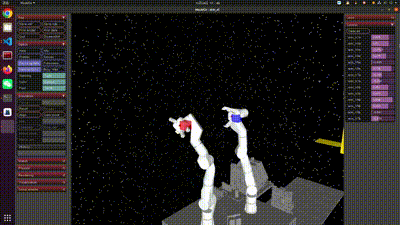
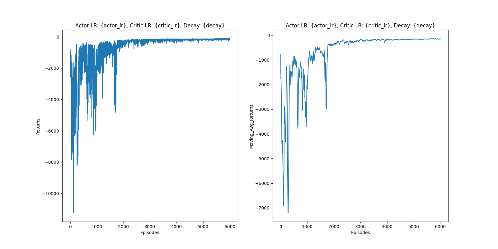
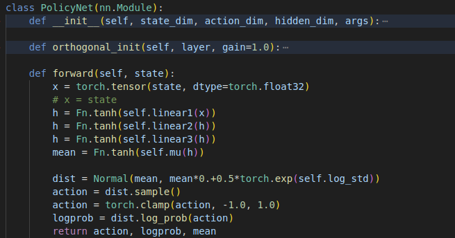
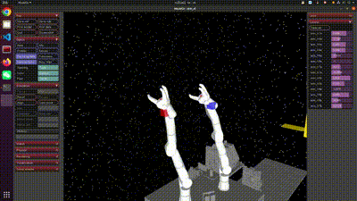
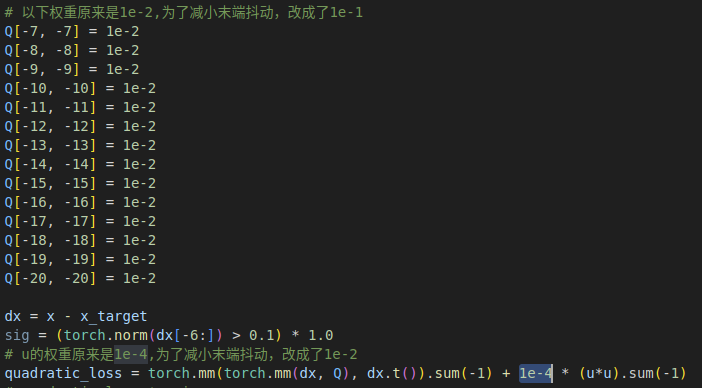
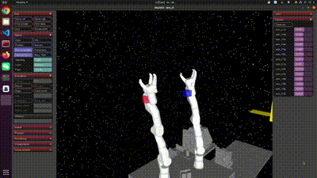

# 主要成果
添加了学习率衰减器，确保cost快要收敛时以较小的学习率进行训练，防止出现发散现象

# 当前问题
（1） **训练过程中的发散问题**：在训练过程中发现经常会出现前期已经收敛，但后期又开始发散的情况。
（2）**机械臂的抖动问题**：从图中可以看出，在机械臂末端接近目标点时，机械臂没有停止动作，而是继续在目标点附近抖动。此外，我还发现如果将评估策略函数中的步长延长的话（比如说从500延长到2000，500是train_model中的timesteps），机械臂会失去稳定状态。

# 问题1解决方法
添加了学习率衰减器，确保cost快要收敛时以较小的学习率进行训练，防止出现发散现象
- 编号00：actor_initial_lr = critic_initial_lr = 0.0002, decay = 0.9 
- 编号01：actor_initial_lr = critic_initial_lr = 0.0005, decay = 0.8 **效果最好**
- 编号02：actor_initial_lr = critic_initial_lr = 0.0001, decay = 0.9 
尝试了以上几组参数，最终编号01的参数组合效果最好，既能很快收敛又能保证较小的收敛值（-150左右），因此后续使用该组组合。 

# 问题2解决方法
## 动作输出
首先考虑评估时的输出动作，策略网络中定义了当前动作的均值和添加了噪声的采样动作。在训练过程中应该使用添加了噪声的采样动作，在评估过程中应该使用动作均值。为此在评估函数中使用动作均值，但是效果甚微，机械臂仍然会抖动。

## 参数调整
### 调整环境物理参数
上网查询得知xml文件中的环境物理参数设置可能会导致小幅抖动被不断放大，考虑增加关节的阻尼系数(damping)
**PS:目前xml文件中damping=5，速度驱动器中kv=5。且从张瀚昂那儿得知，他那部分要想保持稳定，damping必须大于kv**
#### 改进damping
增大damping的值（5 -> 10），reward显示能收敛，但实际效果并无明显改进（对应编号05）。
#### 改进kv
考虑到kv过大可能会放大速度的影响，所以将kv减小到0.5进行训练，然后reward虽然收敛，但是值太大，而且也没有使抖动消失,如下图所示（对应03）。

编号03：actor_initial_lr = critic_initial_lr = 0.0005, decay = 0.8 
效果不行，收敛值为-350
ps：03的xml文件中damping=5， kv=0.5
编号04：actor_initial_lr = critic_initial_lr = 0.0005, decay = 0.8 
效果不行，收敛值为-350
ps：04的xml文件中damping=2， kv=0.5
### 调整cost权重

在调整环境物理参数无效后，考虑修改Compute_cost函数中关节速度和action的权重，原始权重分别为1e-2和1e-4，分别增大到1e-1和1e-2。效果如下：

再都增大到1，效果如下，可以看到由于关节速度权重太大导致机械臂几乎不动。

