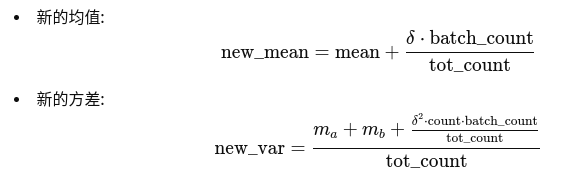

# 主要成果
使用了PPO算法的另一种实现，实现了机器人卫星的稳定运动控制，解决了抖动问题和长时序问题。

## 具体内容
原来的PPO算法实现总是不稳定，会遇到机械臂抖动问题和长时序问题，其运动过程中的动作状态值如下所示，在修改了多类超参数和奖励函数的设置后均无果，而后尝试了另一种PPO算法实现的代码。

下面先介绍另一种ppo算法（下文称之为ppo_refer）的具体实现，以及和以前的ppo算法（称之为PPO）的不同之处，最后展示ppo_refer的效果。

关于两种ppo算法的实现，其思路基本一致，但在某些细节有所出入。一个较大的区别是ppo_refer在训练时会对运动过程中的状态进行归一化，并在一次训练结束后更新状态的均值和误差，归一化和动态更新的公式如下所示：

由于需要对运动过程中的状态进行归一化，所以再保存神经网络的同时还需要保存训练中的状态，以获取均值和方差。

PS1：ppo_refer中没有对策略网络输出的动作进行裁剪使其保持在[-1,1]之间，当添加了动作裁剪后训练过程中很容易出现PolicyNet中的mu或std为nan的情况，从而导致出错，目前还没有有效解决。
PS2：经过验证，在奖励函数中对控制动作u的权重需要适量增大，当u的权重为1e-4时，训练结果仍会出现抖动情况；当增大到1e-2时，便能达到稳定的运动控制。
PS3：经过验证，目前单臂能够在2个200轮训练后实现稳定控制，而双臂时间较长，大约3~4个200轮训练。以上说的是最快达到稳定控制的平均轮次，但一般继续训练还能够再增大奖励值。

训练过程中的动作和状态变化如下所示：

上图是单臂训练好后，对策略进行评价时动作，状态和距离的变化曲线。从图中可以看出，大概300个时间步长后，就全都趋于稳定（即动作都为0）。图中可以看出有两个动作没有收敛到0，但是对于的关节角度没有变化，这是因为关节角度已经到了限位位置。

上图是双臂的评价策略过程，从图中可以看出动作在400轮左右边全都趋于0，不过状态在1000轮左右才彻底稳定，这是因为即便动作只有0.01，对于关节还是会做出一些变化。