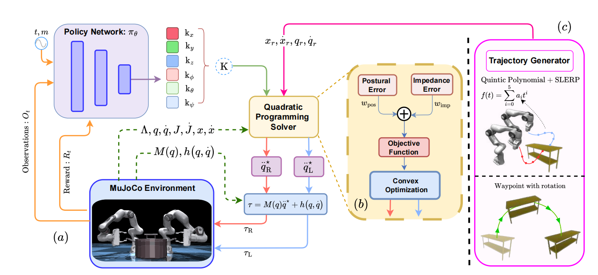
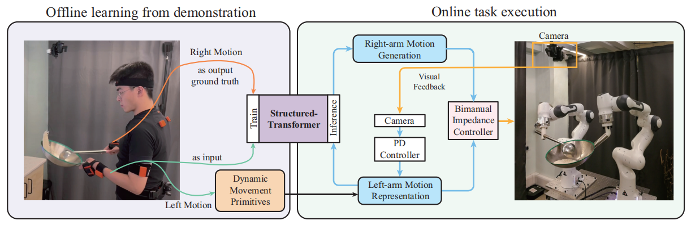
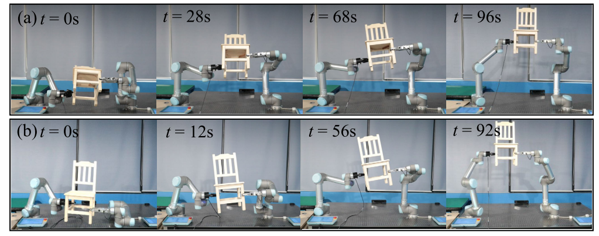
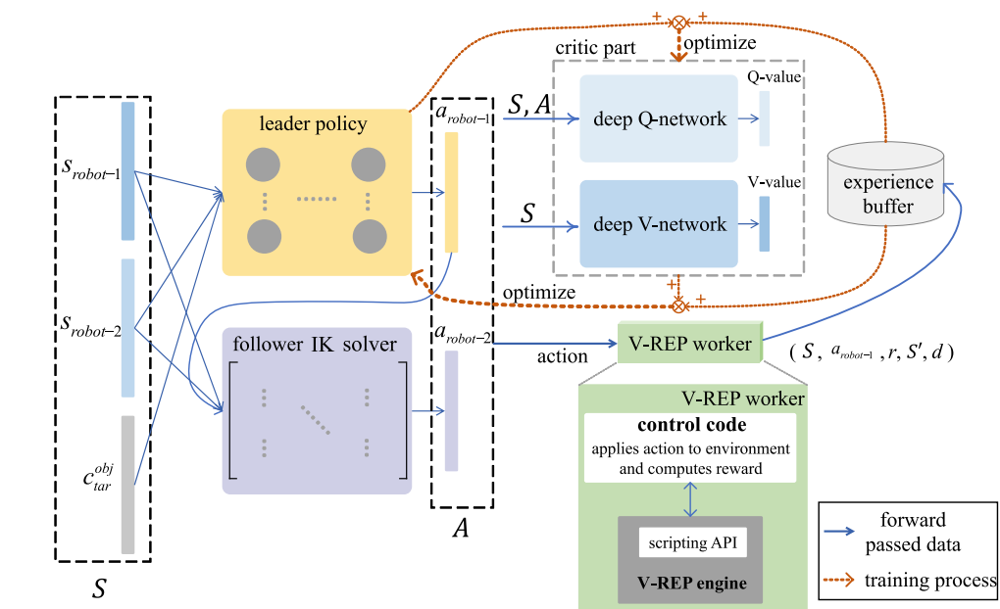
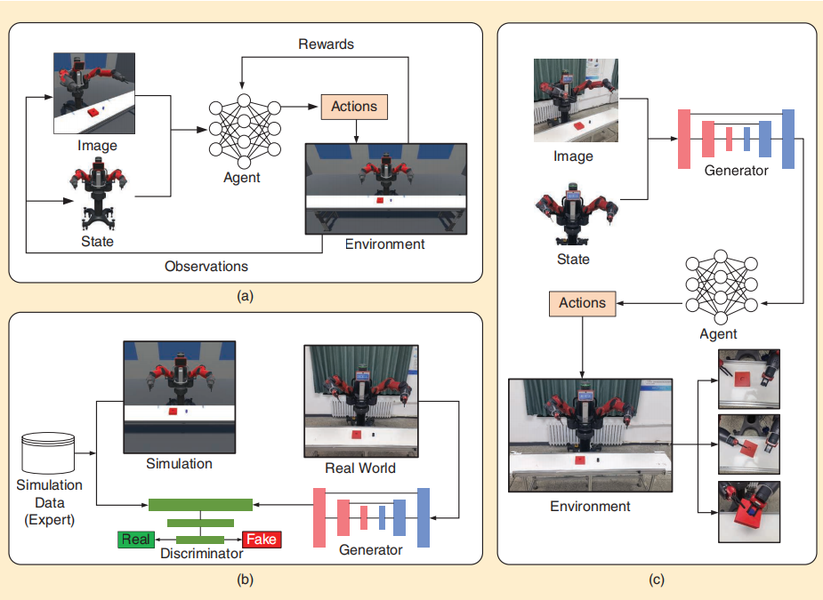

## 强化学习规划控制
本周进行了算法的部分完善，目前算法出现的问题是：在某次训练时得到的策略效果已经不错，这里的不错是指在到达目标位置时能保持**长期稳定**，但是后期的训练虽然可能增大奖励回报，但会打破稳定性。比如说，第300次训练得return是-300，但此时已经达到稳定；继续训练到第400次奖励增大到-200，但此时已经不稳定了。虽然继续训练也可能使得不稳定态变回稳定态，比如说第600次训练奖励为-100，而且能稳定，但这并不是每次都行。因此我在保存策略文件时多加了一个判定条件：对当前训练得到的策略进行评估，如果大于训练的奖励，则不保存，这样得到的策略基本能够保持稳定。

## 双臂机器人协调灵巧作业调研报告

#### `DA-VIL: Adaptive Dual-Arm Manipulation with Reinforcement Learning and Variable Impedance Control(2024)`
项目：`https://dualarmvil.github.io/Dual-Arm-VIL/`(代码还没更新)

这篇论文针对了两个机械臂同时接触物体的复杂参数变化（紧密耦合，工作空间限制，物体参数变化），结合了强化学习方法和基于优化的变阻抗控制方法，使系统能够调整刚度和阻尼，从而能够处理不同质量和形状的物体。论文里已经实现了双臂抓取，拾取和放置的功能。此外，该论文应该也是在mujoco环境中搭建的(再fig2中提到了mujoco控制器)，而且使用的强化学习算法也是PPO算法，值得认真学习。
其中的方法大致可以分为两部分：
（1）一个策略网络，用于预测刚度参数K；
（2）一个基于凸优化的控制器，使用刚度参数K计算关节加速度，随后计算并执行模拟中的扭矩τ。阻尼参数D被设置为使系统始终处于临界阻尼状态。

#### `RoboTwin: Dual-Arm Robot Benchmark with Generative Digital Twins (early version 2024)`
项目：`https://robotwin-benchmark.github.io/early-version/`
这篇论文不是讲怎么训练机器人的，而是结合真实世界数据和生成式数字孪生技术，解决了机器人训练数据的短缺问题。所以里面的内容有点看不懂，但是演示的demo中涉及到双臂机器人的协调操作，而且还有github代码。周六下载demo简单运行了一下，感觉对cpu配置要求可能比较高，源代码中batch_size=128，我改到32才能成功运行`train.sh`，而且花费时间也很长，config里定义epoch为300，我花了两个小时差不多才跑了30轮。代码还没有细看，只是简单运行了一下。
demo里的实现方法是扩散策略（Diffusion Policy）和3D扩散策略（3d Diffusion Policy）,将机器人的动作序列视为一个“数据生成过程”，并通过扩散模型来优化动作序列。该方法通过模拟数据生成过程来优化机器人的动作和决策，尤其适用于复杂的视觉运动任务。

#### `Robot Cooking with Stir-fry: Bimanual Non-prehensile Manipulation of Semi-fluid Objects(2022)`
项目：`https://github.com/Skylark0924/Rofunc?tab=readme-ov-file`
项目介绍：Rofunc 包重点关注（人形）机器人操作的模仿学习 (IL)、强化学习 (RL) 和演示学习 (LfD)。它提供了有价值且方便的Python函数，包括演示采集、数据预处理、LfD算法、规划和控制方法。我们还提供基于 IsaacGym 和 OmniIsaacGym 的机器人模拟器进行评估。该软件包旨在通过构建全流程工具包和验证平台来推进该领域的发展，简化和标准化演示数据收集、处理、学习及其在机器人上部署的过程
论文说明：这篇论文是在demo里related work找到的相关论文，它是针对炒菜这个复杂双臂任务提出一种从人类演示中学习双臂机器人炒菜技能的方法，如下图所示。

方法大致如下：
- 1.解耦双臂协调框架
  左臂（领导者）：通过动态运动基元（DMP）学习左臂的标准炒菜轨迹，并实现可调节的运动。DMP 允许左臂在不同起始和目标姿势下执行相同的炒菜行为。左臂的运动被分为三个阶段（向前推、旋转、向后拉），每个阶段由不同的 DMP 表示。
  右臂（跟随者）：基于左臂的运动生成右臂的运动，通过结构化 Transformer 捕捉双臂的时空关系。右臂的运动依赖于左臂的当前和历史运动，生成平滑且协调的动作。

- 2.结构化 Transformer 模型
  **核心思想**：结合图结构和 Transformer 序列学习，捕捉双臂运动之间的时空关系。
  编码器：编码左臂的运动序列，捕捉时间信息。
  解码器：解码右臂的运动序列，结合图结构捕捉空间关系。
  图模块：显式建模双臂运动之间的空间关系，生成整个图的嵌入。
  **模型结构**：
  输入：左臂的当前和历史运动序列。
  输出：右臂的平滑协调运动。
  损失函数：使用动态时间规整（DTW）评估生成的右臂运动与演示的相似性。

- 3.视觉反馈
  目标：通过视觉反馈调整双臂运动，确保相对位移达到预期目标。
  使用 RGB-D 相机捕捉锅中的内容状态，通过图像处理技术分割内容区域。 
  计算相对位移，并将其作为调整双臂运动的依据。
PS：这篇论文主要是用来模仿学习，仿真平台是pybullet。

#### `A Task-Adaptive Deep Reinforcement Learning Framework for Dual-Arm Robot Manipulation(2024)`
这篇论文的任务是双臂机器人（ur5）协作运输几何规则的物体（椅子和木框架），如下图所示。

这篇论文提出的方式如下所示：将双臂分成领导者和跟随者，针对领导者提出了一种基于actor-critic的深度强化学习框架，跟随者则使用基于Damped Least Squares（DLS）的逆运动学求解器生成动作，基于闭链约束和其他任务约束（如碰撞避免、时间效率等）设计奖励函数（论文中的公式推导还没细看）。

- 实验I：将物体操纵到随机选择的目标姿势
  任务描述：将椅子操纵到球形工作空间内的随机目标姿势。
  结果：所提出框架在训练后能够成功将椅子移动到目标位置，且在不同最大动作幅度下表现稳定。与纯 DRL 算法相比，所提出框架的成功率更高，收敛更快。
- 实验II：在狭窄空间内操纵精细结构物体
  任务描述：在狭窄空间内操纵精细的木框架，确保跟随者手臂末端执行器上的力不超过 40N。
  结果：所提出框架生成的轨迹平滑，能够有效完成任务，且在实际机器人手臂上验证了其可行性。

#### `Mastering the Complex Assembly Task With a Dual-Arm Robot: A Novel Reinforcement Learning Method(2023)`
这篇论文涉及到了双臂机器人的装配任务。
这篇论文提出了一种基于模拟到真实迁移的新型强​​化学习方法。基于视觉的智能体首先在模拟环境中采用PPO算法进行训练，生成针对特定任务的大量标记数据。由于模拟环境与真实环境之间存在巨大差距，基于视觉的代理很难在现实世界中使用。因此，模拟环境到真实环境的转换是机器人在现实世界中性能的关键点。在此过程中，选择了基于视觉的策略的交互式 IL 方法（具体来说就是generative adversarial imitation learning, GAIL）。一旦获得了转移代理，就将其部署到双臂机器人上以获取状态和动作，以通过模拟到真实的转移来改善真实机器人的行为。

如图5所示，a图是模拟环境内的训练（我目前要做的就是这个），b图是模拟环境到真实环境的传输，c图是真实环境的机器人操作。

问题是这篇文章重点是如何从模拟环境到真实环境，关于模拟环境的训练只是一笔带过，稍微介绍了下ppo算法而已，而且也没代码，可能要等到以后实物实验才用得上，对目前仿真实验参考意义不大。

