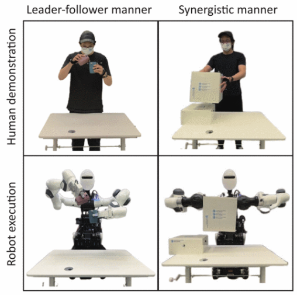
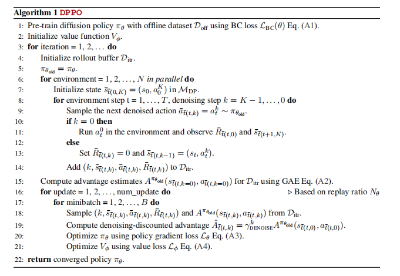

## 双臂协调灵巧作业调研

#### `SERL: A Software Suite for Sample-Efficient Robotic Reinforcement Learning`
项目：`https://serl-robot.github.io/`
想要在现实世界的机器人系统中实现强化学习算法，其复杂性太高，而且以前的算法封装没有一个旨在直接解决现实世界的机器人强化学习。因此这篇文章提出了一个名为SERL的软件框架，旨在促进在现实世界机器人中采用强化学习，和之前一篇侧重点为如何把虚拟环境中的训练策略迁移到真实环境中有点类似。SERL中包括一个样本高效的非策略深度强化学习方法、奖励计算方法、环境重置自动化、一个高质量的机器人控制器和示例任务。这个套件主要实现了高效的学习，平均在25到50分钟内学习各种任务的策略，优于最先进的结果。

SERL里的强化学习算法框架是建立在RLPD算法（Efficient Online Reinforcement Learning with Offline Data）的基础上的。要想将现实世界的机器人学习问题转换为强化学习问题，有以下几个关键：
- 学习算法的样本效率要高，现实世界的训练是有代价的
- 可以使用off-policy的RL算法提高样本效率
- 可以通过结合先前的数据和演示来加速样本效率
- 奖励函数可能取决于图像观察，难以手动指定

核心强化学习算法源自RLPD，RLPD本身是soft actor-critic变体：一种off-policy q函数 actor-critic 方法，可以很容易地将先前数据（次优数据或演示）合并到回放缓冲区中，以实现高效学习。奖励函数可以用二元分类器或vice指定，这提供了一种在rl训练期间用policy的额外负数更新分类器的方法。在机器人状态足以评估成功的情况下，也可以手动指定奖励函数。重置可以通过前向后向架构提供，其中算法同时训练两个policies：执行任务的前向policy和将环境重置回初始状态的后向policy。

#### `Efficient Online Reinforcement Learning with Offline Data`
这篇论文对应上面SERL中提到的RLPD算法，主要介绍了如何在online训练中使用offline数据来提升学习效果，本质上应该还是online RL。
传统的在线强化学习(online RL)有以下特点：
- 实时学习，持续交互：agent需要在线的与环境进行交互，在交互的同时不断进行学习
- 对于数据的利用率较低，尤其是在真实环境中，数据的收集代价很大

为了更好的利用数据，提高样本使用率，可以使用离线数据训练。先前的方法需要一些预训练或者引入约束来应用1离线数据，而这篇文章没有设置复杂的机制，只是将离线数据也放到了回放缓冲区中。将问题表述为马尔科夫决策过程，表示为六元组$(S, A, \gamma, p, r, d_0)$，$d_0$是初始状态分布。现在的研究就是在拥有离线数据集D的情况下进行强化学习，数据集D是有某特定MDP生成的一组$(s, a, r, r')$元组。

本文提出来一种基于无模型的off-policy强化学习方法，无需预训练或显示约束，称之为`RLPD(Reinforcement Learning with Prior Data)`，在SAC的基础上进行了3点改进：
- 采用**对称采样**(***symmetric sampling***)来引入先验数据（即离线数据集D），顾名思义，每个训练批次中有50%的数据来自离线数据集，剩下的50%从回放缓冲区中采样。
- 使用**层归一化**(***Layer Normalization***)技术。对于离线数据集D，由于缺乏完整的状态-动作覆盖，在学习过程中可能会因为函数逼近而导致值函数的过高估计，从而使训练不稳定。因此，需要对值函数进行限制，层归一化相当于对值函数设置一个上限，减轻发散问题，从而显著提高性能。
- ***Sample efficient RL***：为了对质量较高的offline data进行充分利用，考虑增加回放比(*update-to-data (UTD) ratio*)，即每一次与环境交互后更新模型的次数。

<!--  -->
总体上看，使用`online learning with offline data`的主要问题和`offline RL`一致，即避免外推误差和高估，无论是对称采样中online data的利用，还是LN或是sample efficient RL的正则化，目的都是这样。

PS：这里需要对on-policy, off-policy, online RL, 和offline RL做出一些区分。个人认为，online和offline的区别是是否与环境进行交互，前者需要和环境交互获取样本数据，后者则不需要环境交互，只需要固定的数据集就能训练；on-policy和off-policy关乎到强化学习中的两个部分：数据收集和策略优化，on-policy中数据收集中的策略和要优化的策略是同一个，off-policy中数据收集是用一个固定的策略，要优化的策略是另一个。举例来说，on-policy就是在自己下棋的过程中不断学习提升水平，off-policy就是在看别人下棋的过程中不断学习提升水平。online RL中既有on-policy方法，也有off-policy方法；offline RL只能是off-policy方法（个人理解）。

#### `SoftGPT: Learn Goal-Oriented Soft Object Manipulation Skills by Generative Pre-Trained Heterogeneous Graph Transformer`
这篇论文用了之前提到的Rosfunc，主要针对软物体操作任务，如家庭场景中的擀面团。这篇论文是模仿学习方法。
<!--  -->
软体对象操纵的难题包括操作物体形状变化的表示和软体对象的动力学。本文中采用一个名为 SoftGPT 的基于 GPT 的模型来学习机器人操纵与软物体形状变化之间的关系，作为机器人研究中的预训练模型。

#### `BiRP: Learning Robot Generalized Bimanual Coordination Using Relative Parameterization Method on Human Demonstration`
这篇论文也是基于模仿学习的方法，使用了学习演示(Learning From Demonstration, LFD)方法。两种主要的双手协调方式是领导-跟随协调和协同协调。从人类演示中学习这些协调方式需要能够从运动数据中提取隐式协调信息并将其部署到具有不同任务参数的新情况中。这篇文章的主要贡献就是提出了一种相对参数化方法（BiRP），用于从人体演示中提取协调关系并将其嵌入到每个手臂的运动生成中。
相对参数化的定义是一种参数化双手手臂之间的相对关系并将这种关系嵌入到每个手臂的表示中的方法，其形式取决于特定于任务的协调特征，如果要求双手同时抓取同一个物体并保持握住直到放下，则相对关系可以是末端执行器的相对位移。

一点想法：BiRP方法可以作为强化学习中的数据增强工具。通过从人类演示中提取双手协调信息，可以生成大量的协调运动数据，这些数据或许可以作为强化学习中的离线数据集。

##### `https://github.com/rail-berkeley/serl && https://github.com/ikostrikov/rlpd`
这两个demo是serl和rlpd算法的项目，serl能跑通一个状态观察示例训练得py，rlpd运行提示需要cuda12.6，但是我的nvidia驱动最高只能到cuda12.4。

#### `https://github.com/Skylark0924/Rofunc`
这个demo里有基于强化学习的双臂机器人操作的demo(isaacgym环境)，如下所示。本来想跑通这个demo，但是忙活两天一直跑不起来，感觉还是cuda的问题，但是一直没能解决。此外，该项目里少了很多文件，比如说对于的config.yaml和urdf文件，找作者反映了下，提供了urdf文件。
PS:如若一直跑不通，就参考代码学习吧，看看人家是怎么用强化学习训练的。

#### `https://github.com/Genesis-Embodied-AI/Genesis`
下载了Genesis生成式物理引擎demo，照着说明简单运行了一下，文档里说4090只需要26s就能完成一个可迁移到真实世界的机器人（四足）运动策略，我电脑2060，跑了20分钟才跑，效果倒是都一样，都是四足步行。
PS：我训练慢的原因可能是没有用gpu训练而是用了cpu，运行时有提示：
`
[W 12/21/24 17:49:18.596 501132] [cuda_driver.cpp:load_lib@36] libcuda.so lib not found.    
[W 12/21/24 17:49:18.597 501132] [misc.py:adaptive_arch_select@758] Arch=[<Arch.cuda: 3>] is not supported, falling back to CPU
`
但是这个问题没能解决，我重装了cuda和cudnn，重置了软连接都没用。

PS:这两天上网搜了下genesis相关内容，发现很多帖子都是持质疑态度，怀疑夸大宣传，虽然有些评论看不懂，但还是持保留态度，看进一步情况。

#### `Bi-Manual Manipulation and Attachment via Sim-to-Real Reinforcement Learning`
这篇文章的操作任务是让两个机器人手臂拾取并连接两个带有磁性连接点的积木工具，采用的方式是PPO算法，仿真环境为mujoco。注意，操作任务并不只是仿真，事实上，这篇论文提出了一种针对于现实世界中双臂机器人操作控制的模拟到现实的强化学习策略，重点研究如何在模拟环境中训练双手操作策略，使其可以在现实世界的机器人系统上成功执行。
整体思路如下图所示：
- （1）目标跟踪和状态估计
为防止操作过程中的遮挡，用3个摄像头进行跟踪，计算基座中心和积木之间的相对位置和方向，积木的状态由3个跟踪数据聚合并持续更新
- （2）神经网络训练
积木的跟踪估计、两个机械臂的关节位置以及机器人末端执行器的笛卡尔位置直接输入到神经网络模型中，输出为每个关节角度的变化值（可以当成关节速度）和夹爪的闭合值。
- （3）插值控制
模拟环境中的强化学习策略发送的输出是4Hz动作，使用三次样条插值关节位置目标，以生成20Hz的实际关节命令。

本文中采用的是关节空间控制，控制量是关节速度。为了使关节空间策略能再现实世界中可行，在模拟环境中设置了多条约束：关节速度和加速度限制，施加力的限制，噪声（关节估计，关节加速度）
PS:这篇文章提到了使用1张Nvidia V100 GPU进行训练要近10个小时，也反映了RL的耗时长的缺点。
PS:在模拟中训练的策略很少能转移到现实世界系统中，原因包括模型差异和现实世界状态估计中的噪声，这个问题通常被称为Sim2Real问题

#### `Diffusion Policy Visuomotor Policy Learning via Action Diffusion`

- Explicit Policy显式策略
Explicit Policy是行为克隆（behavior cloning）中的一种常见方法，它直接从世界状态或观察结果映射到动作，可以理解为学习从观察结果映射到动作的映射函数。一般来说，行为克隆使用人类演示提供的数据训练模型，该模型可以重现人类演示的动作。
图中有三种动作表示方法：标量，用于连续动作空间；混合高斯函数，用于离散动作空间；分类，用于离散动作空间。Explicit Policy高效但是无法适应高精度和多模态的任务。
- Implicit Policy隐式策略
隐式策略是一种策略学习方法，与显式策略不同，它不直接输出具体的动作，而是通过优化某种能量函数来找到最佳动作。
能量函数：隐式策略通过某个能量函数（参数化模型）定义状态o和动作a之间的关系。
优化过程：在给定状态o的情况下，隐式策略通过找到使能量函数最小化的动作a来决定执行的动作。
适用场景：多模态分布场景（在相同状态下可能有多个合理的动作选择）
- Diffusion Policy扩散策略
先说扩散模型，这是一种概率生成模型，它将随机取样的噪声迭代地从一个潜在的分布中提炼出来，从概念上理解为学习一个隐式动作得分的梯度场，然后在推理过程中优化该梯度。扩散策略不是直接输出动作，而是推断动作得分梯度，并以视觉观察为条件进行去噪迭代得到动作的梯度场。

DDPM训练：
- 从数据集中随机抽取一个未添加噪声的样本$x^0$
- 随机选择一个去噪迭代步数$k$
- 根据迭代步数$k$，从标准正态分布中采样一个随机噪声$\epsilon^k$
- 在样本$x^0$中添加噪声$\epsilon^k$，得到带噪声的样本$x^k$
- 让噪声预测网络$\epsilon_{\theta}(x^0+\epsilon^k,k)$预测从数据样本$x^k$中添加的噪声$\epsilon^k$
- 最小化损失$L = MSE(\epsilon_{\theta}(x^0+\epsilon^k,k),\epsilon^k)$
通过以上步骤，得到一个能够从噪声中生成数据分布的生成模型。对于机器人的操作控制，$x$就是驱动动作，所以算法的目标就是让模型学会从随机得到初始动作（带有噪声的动作）逐步调整到合适的动作，这就是“去噪扩散”。

看到了一个采访这篇论文一作作者的知乎回答，提到了一些问题。
**Diffusion Policy和RL以及IL之间的关系**：
本来以为扩散策略就是模仿学习方法，了解后知道了扩散策略是一种策略逻辑，可以用于RL和IL这两者上，它适用于输入图像并输出相应动作的情景。只是在这篇论文中，将其应用到了IL上，由人类遥控机器人执行动作，收集数据，并通过学习将其转化为策略。这种学习过程通过遥控机器人完成一系列动作开始，然后将其迁移到机器人身上。输入数据包括过去几帧的图像，而输出涉及对未来动作的预测。
关于怎么应用到RL上，由于一般的RL训练输入的都不是图像而是一些低维度的底层状态信息（为了加速训练），而这些状态信息在现实环境中难以直接获取，所以RL Policy不能直接用于驱动机器人。有一种方法是将RL Policy生成的数据用于训练一个将图片作为输出的模型学习策略（该步骤被称为蒸馏）。
**机器人操作和移动的训练有什么不同**：
RL在移动有更好的效果，Sim2Real的问题相对好解决（即规划控制中RL效果更好）；但在操作，RL存在最大的问题是Sim2Real没法很好的解决。对于操控而言，需要考虑的因素较多，其中一个关键区别是在机器人操作中除了需要考虑机器人本身的物理特性，同时还要适应复杂多变的环境和被操作物体。操控涉及与各种各样的物体进行交互，每个物体都具有独特的物理特性，如重心、摩擦力和动力学。这些在模拟器中难以准确模拟，即便能够模拟，精度通常较低，速度较慢。相比之下，对于locomotion，外界环境大多可以视为一个刚体，物理特性基本可以忽略。这使得可以花费更多时间来建立机器人本体的精确物理模型，以及设计更复杂的物理引擎。这是为什么RL更适合Locomotion，而对有物理机器人部署Manipulation没有那么好的效果。

#### `Diffusion Policy Policy Optimization (DPPO)`
演示：`https://diffusion-ppo.github.io/`
这篇论文是在了解扩散策略是什么的时候找到的，它提出来一种结合了扩散策略和强化学习的方法，该算法以使用行为克隆损失$L_{BC}$预训练的扩散策略$\pi_{\theta}$为起点，用过多步去噪过程进行调节，采用类似近端策略优化（PPO）的损失$L_{PPO}$对策略进行微调。该算法构建了一个两层 MDP，其中外层对应环境 MDP，内层对应去噪 MDP（将去噪扩散过程视为一个MDP）。

在文章附录里的`相关工作扩展`中讨论了`使用离线数据进行训练的RL`和`基于扩散的RL方法`。前者提到了两种使用离线数据的研究路线：一种是使用离线数据进行策略预训练，然后在线微调策略，也就是本文中DPPO所采用的方法；另一种是直接将离线数据添加到回放缓冲区中以进行online的off-policy学习，也就是上文中我所提到的**RLPD**方法。在本文的实验验证5.2小节，将提出的DPPO方法和RLPD进行了对比，发现RLPD在处理噪声演示时，学习效果较差，而DPPO的整体表现最好。

算法的实现细节在正文的第4大节和附录的B部分中有具体说明，目前还在学习中。。。

#### `robosuite: A Modular Simulation Framework and Benchmark for Robot Learning`
演示：`https://robosuite.ai/`
robosuite 是一个由MuJoCo物理引擎驱动的机器人学习仿真框架，还提供一套可重复研究的基准环境。
robosuite 框架提供了两类主要的 API：
- 建模 API：能以模块化和编程方式定义模拟环境。
- 模拟 API：用于与外部输入（如策略或 I/O 设备）进行交互。
通过建模 API 指定的模拟模型由 MuJoCo 引擎实例化，从而创建一个模拟运行时环境，称为Environment。Environment 借助传感器生成观测数据，同时通过机器人的控制器接收来自策略或设备的动作指令

