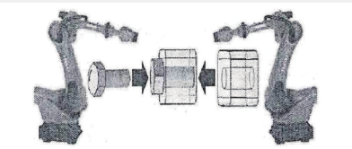
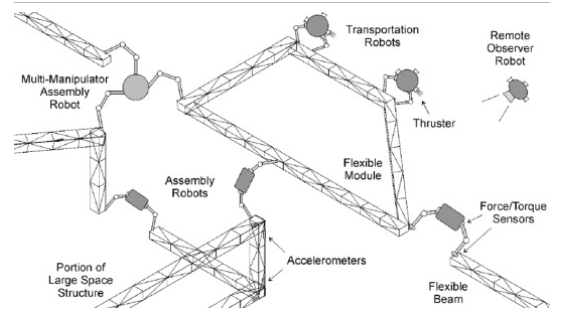

## 研究内容

### 研究任务
常用的双机器人协作被用到轴孔装配、复杂路径焊接、搬运大型物体或重型物体等场合，以轴孔装配为例：
一个机器人精准定位到轴孔位置, 将螺栓安装在对应位置, 另一机器人根据螺栓位置, 持有螺母, 到达相应位置, 两机器人相互配合拧紧螺母, 完成装配。这类应用需要机器人具有极高的定位能力和极强的柔顺性, 才能完成螺栓螺母装配的取、放、拧紧这一系列需求, 如图所示。


空间机器人操作的研究任务是协调机器人卫星，以完成太空环境中的特定操作，比如说装配、拆卸和搬运。基于在轨装配技术实现在轨维护的典型人物有日本的ETS-VII，美国的“试验卫星系统”和哈勃望远镜在轨维护等；天宫二号空间站也开展了人机协同在轨操控实验，主要面向航天装备在轨装配和拆卸任务。再贵装配的具体任务包括航天器、空间系统和空间结构的在轨构建、替换、连接、组合和重组，大到大型独立舱段的在轨对接，小到模块更换、电池安装等任务。



再以空间机器人的**自主桁架组装**为例，空间桁架作为空间站一类重要基础设施，在空间站建设中起着不可替代的作用。考虑到组装好的空间桁架所占空间以及火箭的运载能力，一般采用将桁架部件发射入太空并在轨道完成组装。机器人在桁架组装中执行多项任务，例如机械臂停靠、组件操作、避免碰撞的机械臂轨迹控制、考虑与环境接触的组装等。在组装过程中，操作桁架组件并将其连接到节点是组装的关键步骤，其中涉及到插、拔孔操作。
在轨空间机器人任务分为6个阶段：
(i) 近距离会合和接近：机械手开始任何操作，如捕获）、靠泊、修理、装配等之前，跟踪航天器必须到达目标附近，进行交会，并与目标同步其轨道运动。
(ii) 目标识别：在某些空间机器人操作中，抓取点或对接点事必须识别的目标，机械臂需要锁定或对接到目标上。
(iii) 与目标的姿态同步：在执行任务前尽量实现姿态同步，有助于协助目标识别和提高接触性能。
(iv) 机械臂部署：控制机械臂达到目标的抓取点
(v) 捕获：完成对目标（卫星）的抓取
(vi) 捕获后操作：执行具体的操作任务
以目标卫星的修理为例，首先是近距离的接近，然后需要识别目标卫星的把手和待修理位置，实现同步后即可进行抓取（单臂），抓取后另一只机械臂在移动到待修理位置执行任务。
简单来说，机器人卫星的双臂协调操作任务可以分解为：接近-抓取-对准-安装。

参考youtube视频：
https://www.youtube.com/watch?v=hieqTEaEBQo

### 研究难点
空间机器人实施目标卫星的捕获、维修和再利用等在轨操作任务存在以下难点：

- 双臂（或多臂）处理目标时的协同操作难度大：与单臂操作相比，双臂任务涉及更复杂的交互和更精细的控制。空间机器人执行双臂协同操作任务时，要求两臂之间实现高度同步的运动轨迹规划和实时调整。然而，当两个机械臂接触同一个物体时，由于臂与物体之间的紧密耦合，会出现多种约束：由于两个臂可能同时接触一个物体（如装配），一个手臂的动作可能会通过物体间接影响另一个手臂；由于每个臂的运动都受到另一个臂的限制，从而减少了任务可用的整体工作空间；物体参数的变化和待操作位置的狭小受限空间等进一步加大了操作复杂度，对空间机器人的自主决策问题提出较高要求。

- 执行长时序操作任务时不稳定：空间任务通常需要机器人执行复杂的、包含多个阶段的长时序操作，如目标识别、抓取、搬运和安装等。这些任务不仅对每个阶段的成功率有严格要求，而且每个阶段的失败可能导致任务整体无法完成。

- 漂浮基座环境：相对于固定基座，漂浮基座的机器人卫星在执行操作任务时，容易使基座的质心位置、姿态产生巨大的偏移，从而导致基座失稳。此外，基座位姿的改变也会导致机械臂末端轨迹产生较大的跟踪误差，所以在执行操作任务时，还需要保证基座的稳定状态。

- 高精度要求：空间机器人在执行任务时，通常需要在厘米级甚至更高的精度范围内操作目标（如紧固螺栓、安装部件等），这对机械臂的轨迹规划和末端执行器的稳定性提出了极高要求。此外，使用强化学习方法时，也会有动作输出的不稳定性和高频振动现象等常见问题。


## 调研方向
### 先前的调研
由于之前实现了基于PPO算法的机械臂规划控制，所以先前的调研侧重于基于强化学习的双臂协调方法，其中解决的问题主要是当前的强化学习在某些方面存在的问题，比如说模拟环境的RL策略怎样迁移到真实环境中，怎么结合RL和离线数据集以实现对数据的高利用率。对于传统的控制方法（比如说混合位置/力控制，阻抗控制），没有进行过多调研。
之所以采用基于强化学习的方法，是因为传统的控制方法通常依赖于精确的动力学模型，但在实际应用中，模型的复杂性和不确定性使得这些方法难以实现，而强化学习不需要精确的动力学模型，只需要与环境交互来学习策略，使用起来更加灵活。此外，深度强化学习（DRL）结合了深度学习的表征能力和强化学习的决策能力，非常适合高维状态空间和连续动作空间的机器人任务。
PS：之前的想法是先找到一个项目跑通，然后参考其中的代码实现和论文方法进行学习，因为我个人认为上述的研究难点肯定会在代码中有所体现。

### 复现工作
#### `Diffusion Policy Policy Optimization`
使用这篇论文中的方法进行训练，尝试了Transport任务，文中提到最终训练得到的成功率大于**90%**，是目前第一个将Transport任务解决大于**50%**的RL算法，目前也已经复现了这一任务。
从图中可以看出，Transport任务包含多个步骤：
- 左臂抓取左桌盒子的盖子上的把手，将盖子放置到桌子上；同时右臂取出右桌靠上盒子里的红色方块，腾出地方
- 左臂抓取左桌盒子里的锤子，将其递给右臂；右臂接过锤子，并将其放置在右桌盒子里。


#### `Rofunc`
参考其中的双臂机器人平台设置进行学习


#### 复现工作中的bug总结
（1）基于isaacgym的训练总是显示cuda不可用
解决：根据提示找不到`libcuda.so`，发现原因是该文件名称为`libcuda.so.1`，需要重新建立软链接：
```bash
cd /usr/lib/x86_64-linux-gnu
sudo ln -s libcuda.so.1 libcuda.so
```
