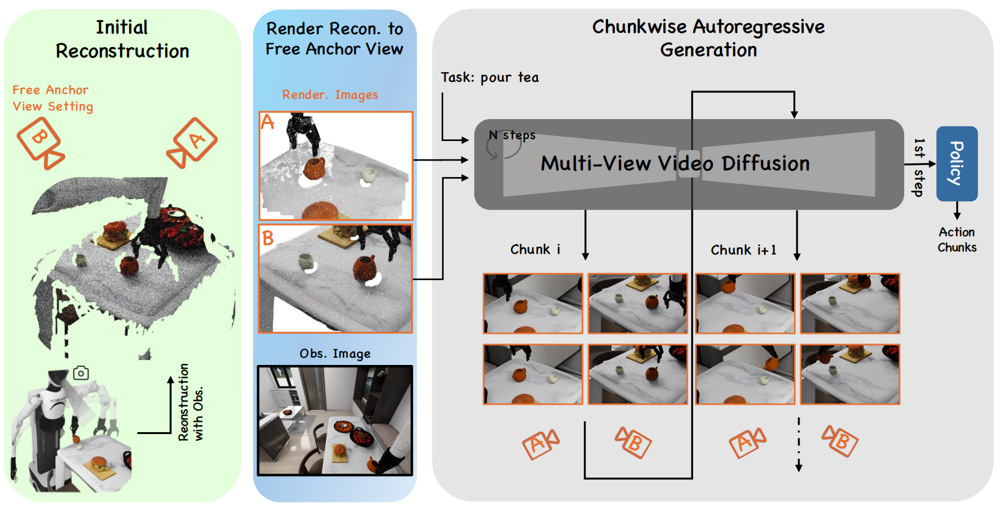
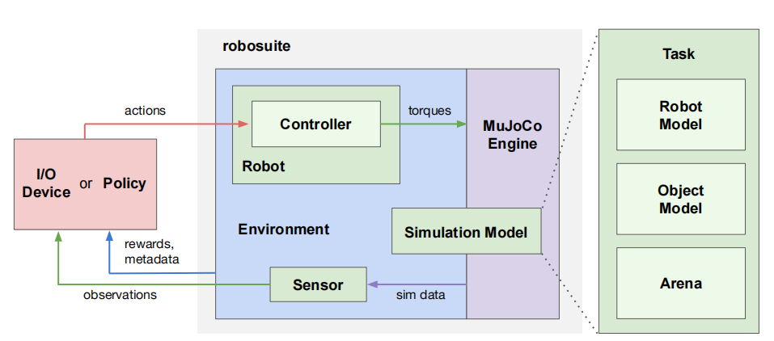

### 复现工作

#### `https://bimanual-imitation.github.io/`
`expert_bimanual_quad_insert.py`
这个python文件实现了基于任务控制的双臂操作任务，任务内容是四角插入，如下图所示

该任务的控制方法是任务空间控制，主要定义了两个动作：WP（机械臂的移动）和Grip（夹爪的抓取）。在yaml文件中将任务分为了不同阶段：Initialization, Open-Grippers, Pre-Grasp-Hover, close-Grippers, Lift-Object, Transfer, Put-Down, Open-Grippers, Dummy。
每个阶段都设置相应的target_xyz和target_quat，即目标位置和姿态，这里有两个重点：
- 一是有三对目标位置和姿态，分别对于基座(base)，左臂(ur5left)，右臂(ur5right)
- 二是yaml文件中的目标位置和姿态是偏移值形式，即真正的目标位置是在当前状态的位置加上yaml文件中的目标位置，至于姿态的表示较复杂

任务驱动控制中的控制器是基于目标位置和姿态进行控制的，也就是说，输入时目标位置和目标姿态，输出是控制力矩，其核心思想是将任务空间（末端执行器的位置、姿态等）的误差映射到关节空间，生成关节力矩或力，驱动机器人达到目标状态。计算过程如下：
- 计算末端执行器和目标状态的误差
- 采用PD控制，其中`stiffness`和`damping`分别对应Kp和Kd
- 将pd控制得到的控制力映射到关节空间生成关节力矩，主要通过雅可比矩阵实现
- 根据机器人的动力学特性优化控制力矩
- 加入导纳控制以提高性能

所以整体来说，任务操作过程的思路是：
将操作过程分为多个阶段，每个阶段有一个目标状态，根据该目标状态生成控制力矩进行控制。

#### `https://diffusion-ppo.github.io/`
`train_ppo_diffusion_agent.py`:
这段代码实现了一个基于PPO的深度强化学习算法，并结合了扩散模型进行动作生成。代码的核心是通过扩散模型生成动作轨迹，并在环境中执行这些动作，同时使用PPO算法对策略进行优化
- 初始化
  - 继承了 `TrainPPOAgent` 类，并在此基础上扩展了与扩散模型相关的功能
  - 设置了奖励范围（`reward_horizon`），通常与动作步数（`act_steps`）一致
- 环境交互
  - 在每个时间步，模型根据当前状态生成动作轨迹
  - 使用生成的动作与环境交互，获取新的状态、奖励和终止信号
  - 记录每一步的观察值、奖励、终止信号等信息
- 奖励计算与总结
  - 计算每个 episode 的累计奖励和成功率
  - 如果环境是稀疏奖励（如家具组装任务），则只计算最终奖励；否则计算整个 episode 的最大奖励
-  模型更新
   - 使用 PPO 算法更新策略网络和值函数网络
   - 计算策略梯度损失（`pg_loss`）、值函数损失（`v_loss`）、熵正则化损失（`entropy_loss`）和行为克隆损失（`bc_loss`）
-  学习率更新
   - 使用余弦退火调度器（`CosineAnnealingWarmupRestarts`）动态调整学习率
   - 在训练初期，先对值函数网络进行预热（`n_critic_warmup_itr`），然后再更新策略网络
- 模型保存
  - 每隔一定迭代次数（`save_model_freq`），保存模型参数
  - 将训练结果（如奖励、成功率等）保存到文件中（`result_path`）

#### `https://sites.google.com/view/enerverse/home`
这是智元机器人的一个专门为机器人操作任务而设计的综合框架，如下图所示。
EnerVerse模型由三个部分组成：
- 构建初始场景模型：
输入是机器人摄像头拍摄的多张环境图片，这些图像捕捉了环境的不同区域和不同角度观察；输出是从图像生成的3维环境表示，即点云数据，同时选择一些适应场景环境和任务需求的锚点视图，为后续场景的完整表示奠定基础。
- 从多个视角补充和完善场景表示（我理解为3维重建，使用FAV渲染器）：
从上一步选择的锚点视图中生成一系列渲染图像，即使用现有的点云数据生成整个场景的渲染图。
- 生成动态的任务执行计划（逐块自回归生成）：
根据上一步的场景整体渲染图像和任务指令，输出表示场景动态变化的多帧图像序列（如机器人在场景中移动的图像），在与策略部分结合后可以生成图像序列对应的动作序列（如机械臂的抓取移动操作）

假设任务是“让机器人抓取桌上的物体”：
输入：机器人拍摄的桌面图像 + 任务目标“抓取物体”。
输出：点云表示桌面 -> 渲染补全的虚拟视图 -> 图像序列显示抓取过程 -> 实际抓取的动作序列。

#### `https://github.com/ARISE-Initiative/robosuite`
robosuite是一个由MuJoCo物理引擎提供支持的模拟框架，用于机器人学习，它进行了模块化设计，提供了一套标准化的基准环境。robosuite的总体目标是为研究人员提供：
- 一组标准化的基准任务，用于严格评估和算法开发；
- 模块化设计，提供灵活性，可以设计新的机器人仿真环境；
- 高质量的机器人控制器实现和现成的学习算法，以降低门槛。
实际上，robosuite提供了一些机器人操作的任务环境，以便于使用控制算法并进行对比实验。

robosuite 框架提供了两类主要的 API：
- 建模 API：能以模块化和编程方式定义模拟环境。
- 模拟 API：用于与外部输入（如策略或 I/O 设备）进行交互。
通过建模API指定的模拟模型由 MuJoCo 引擎实例化，从而创建一个模拟运行时环境，称为 Environment。Environment 借助传感器生成观测数据，同时通过机器人的控制器接收来自策略或设备的动作指令。

模拟模型构成要素：
- Task：定义模拟模型，包含机器人模型、对象模型和竞技场三个关键部分。
- Robot Models：负责加载机器人模型，还可能加载其他相关模型，比如机械臂机器人模型类会从 XML 文件加载对应的夹爪模型。
- Object Model：可从 3D 对象资源加载，也能用编程 API 程序化生成。
- Arena：确定机器人的工作空间，涵盖环境固定装置（如桌面）及其放置位置。任务类会将这些组成部分组合成 MuJoCo 的 MJCF 建模语言中的单个 XML 对象，然后传递给 MuJoCo 引擎以实例化 MjModel 对象，用于模拟运行。

机器人使用流程：
- 初始化：
    - 在创建环境（suite.make (..)）时，单个机器人被实例化和初始化。
    - 所需的 RobotModel、MountModel 和 Controller（对于机械臂双臂机器人等可能指定多个和 / 或额外模型）被加载到每个机器人中，这些模型被传递到环境中以组成最终的 MuJoCo 模拟对象。
    - 然后将每个机器人设置为其初始状态。
- 运行：
    - 在给定的模拟轮次（每次 env.step (...) 调用）中，环境会收到一组动作，并根据每个机器人各自的动作空间将动作分发给它们。
    - 每个机器人通过其各自的控制器将这些动作转换为低级扭矩，并在模拟中直接执行这些扭矩。
    - 在环境步骤结束时，每个机器人将其特定于机器人的观测集传递给环境，环境将这些观测连接并附加额外的任务级观测，然后作为 env.step (...) 调用的输出传递。
- 可调用属性：
    - 在任何给定时间，每个机器人都有一组属性，其实时值可随时访问。
    - 这些属性包括给定机器人的规格，如自由度、动作维度和扭矩限制，以及本体感受值，如关节位置和速度。
    - 如果机器人启用了任何传感器，也可以获取这些传感器的读数。机器人 API 部分有完整的机器人属性列表。

### 下周规划
在mujoco中搭建任务场景，进行简单的测试
参考传统控制方法，进行简单的控制尝试

